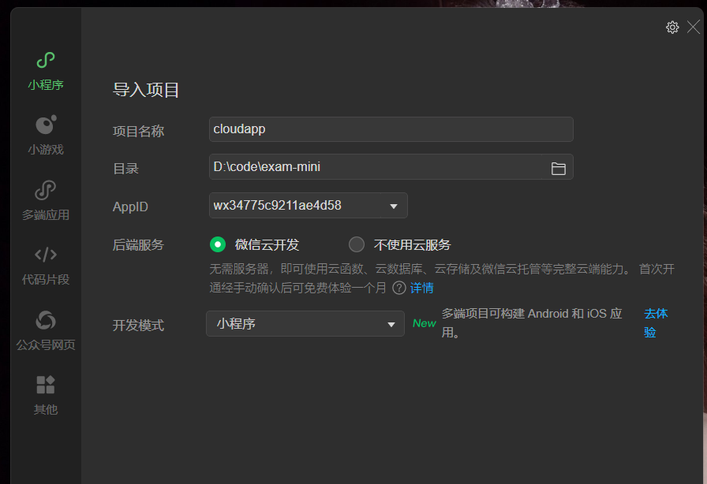
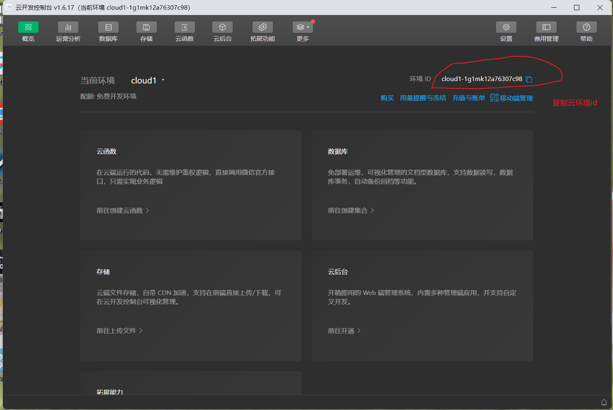
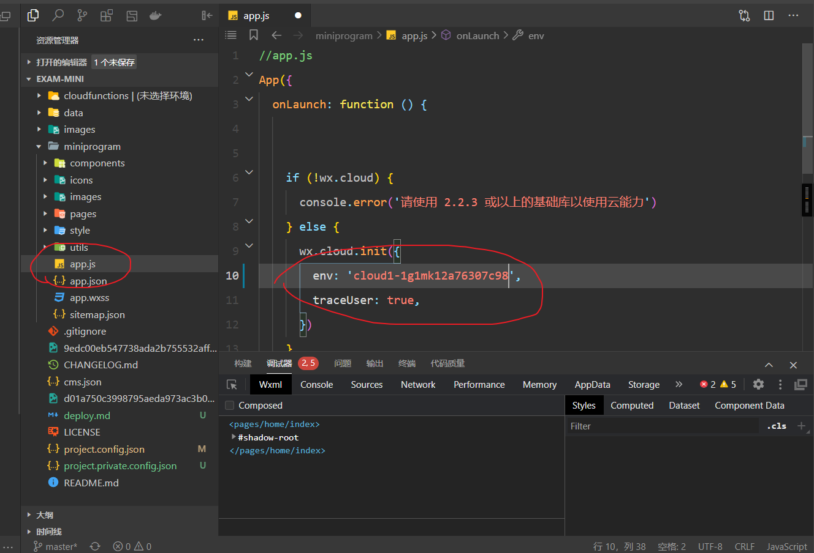
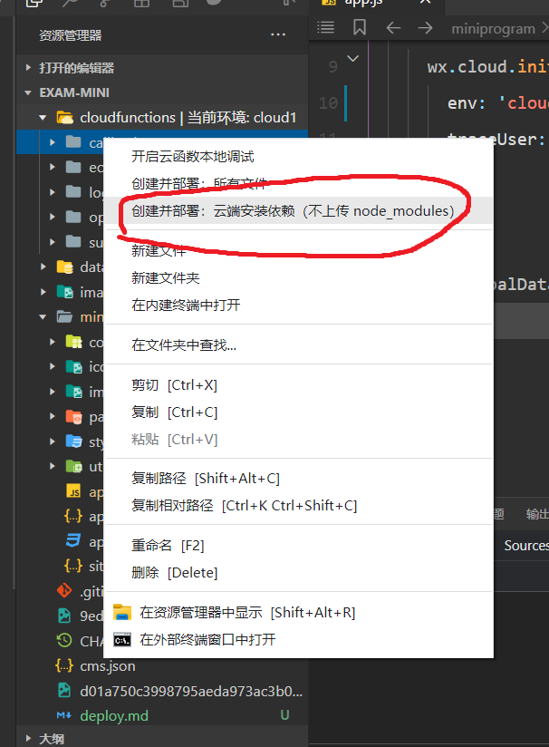
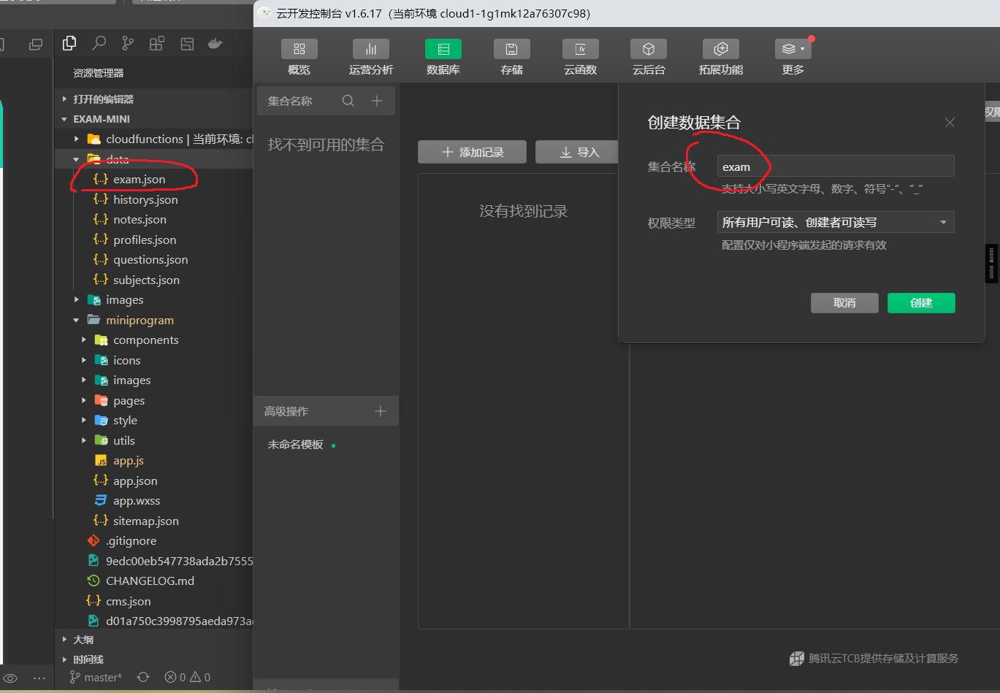

# 微信小程序云开发部署教程

## 目录
- [1. 小程序注册与创建](#1-小程序注册与创建)
- [2. 导入云开发项目](#2-导入云开发项目)
- [3. 配置云开发环境](#3-配置云开发环境)
- [4. 部署CMS内容管理系统](#4-部署cms内容管理系统)
- [5. 常见问题解决](#5-常见问题解决)

---

## 1. 小程序注册与创建

### 1.1 注册小程序账号
1. 访问[微信公众平台](https://mp.weixin.qq.com/)
2. 点击"立即注册"，选择"小程序"
3. 填写邮箱、密码等信息完成注册
4. 登录后完成主体认证（个人或企业），一般来说用个人身份注册会好些，因为企业备案和认证都比个人贵，答题小程序属于在线教育类目，个人和企业资质没有区别。
5. 填写小程序的基本资料，小程序的名称、简称、头像、介绍等信息，这些信息后面可重新修改，等资料审核好了以后，点击左下角的小程序设置，然后在小程序设置中可以设置服务类目（教育-在线教育）

### 1.2 获取AppID
1. 进入"开发管理"->"开发设置"
2. 复制保存你的`AppID`（后续开发需要）

### 1.3 安装开发工具
1. 下载[微信开发者工具](https://developers.weixin.qq.com/miniprogram/dev/devtools/download.html)
2. 安装并打开开发者工具

---

## 2. 导入云开发项目

### 2.1 创建新项目
1. 打开微信开发者工具
2. 点击"导入项目"，进入弹窗后选择信任项目，AppID就是上述从微信公众平台复制的

### 2.2 开启云开发功能
1. 在开发者工具中，点击顶部菜单"云开发"
2. 点击"开通云开发"
3. 选择环境名称（如"dev"、"prod"等）
4. 等待初始化完成

## 3. 配置云开发环境

### 3.1 获取环境ID
1. 在开发者工具中，点击"云开发"图标
2. 在云开发控制台中，点击"设置"
3. 复制"环境ID"

### 3.2 配置项目环境
1. 修改app.js下面的云开发环境

2. 上面的修改好了以后保存，重启开发工具，然后看cloudfunctions文件夹这儿是否出现环境名称，如下图所示
3. 导入云函数,每一个都需要这么导入，这儿的cloudfunctions文件夹是有环境名称的，如果没有的话就是配置失败了，检查上面的每一步

4. 导入云数据库，数据就在data下面，按文件的名称新建集合，创建完成后导入数据

## 4. 部署CMS内容管理系统

### 4.1 开通内容管理(CMS)
1. 在云开发控制台，点击"内容管理"
2. 点击"开通"
3. 设置管理员账号和密码

### 4.2 配置内容模型
1. 进入CMS后台
2. 点击"内容模型"->"导入模型"
3. 模型json就在cms.json中，自行导入即可。

## 5. 常见问题解决

### 5.1 云函数调用失败
- 检查环境ID是否一致
- 检查云函数是否已部署
- 查看云开发控制台的日志

### 5.2 数据库权限问题
1. 在云开发控制台进入"数据库"
2. 选择对应集合
3. 点击"权限设置"
4. 调整为合适的权限（开发阶段可设为"所有用户可读，仅创建者可读写"）

### 6.3 CMS访问问题
- 确保已正确开通CMS服务
- 检查网络连接是否正常
- 确认管理员账号密码正确

